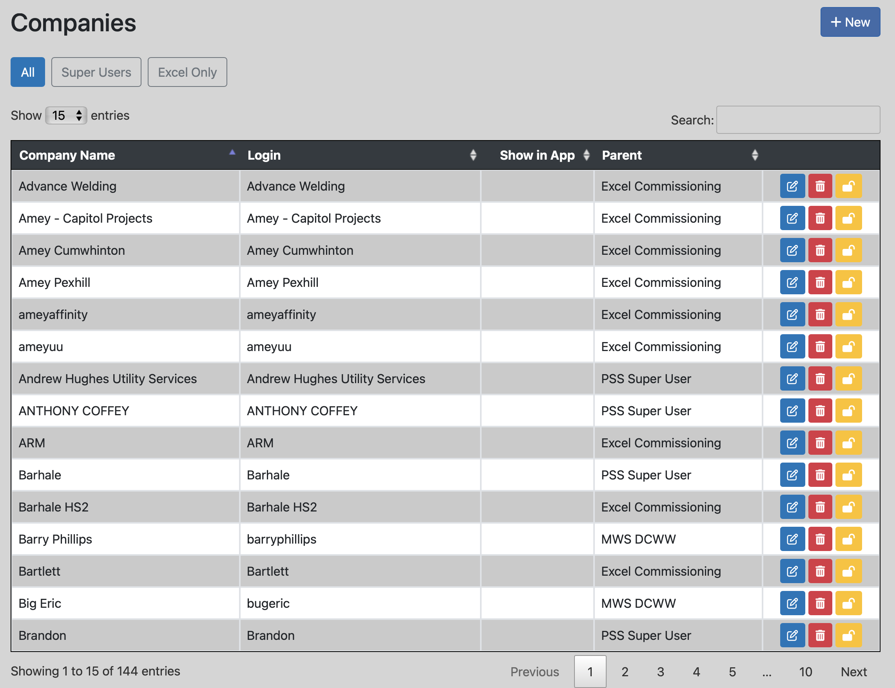

[Back to Index](readme.md)

# Companies List

For each company in the Pipelayer database, the Companies List will show the Company Name, the Login Id for that company, the Show in App status and the company's Parent Company if one has been set.

## Searching the list

Entering text into the Search field will instantly search the data for a company names which contain the entered text, irrespective of case.  i.e. 'WELDING' will produce the same results as 'welding'.

## Filtering the list

| Command | Filter |
| ------- | ------ |
| All | Display all companies |
| Super Users | Display all parent companies, i.e., any company that has one or more child companies |
| Excel Only | Display any company that has 'Show in App' set to true |

## Grid Commands

At the right of each row are a set of command buttons:

| Button | Action |
| ------ | ------ |
| 

 | Edit the company details |
| 

 | Delete the company (you will be asked to confirm) |
| 

 | When enabled will prevent the user from logging in to Pipelayer Server (has no affect in the app) |
