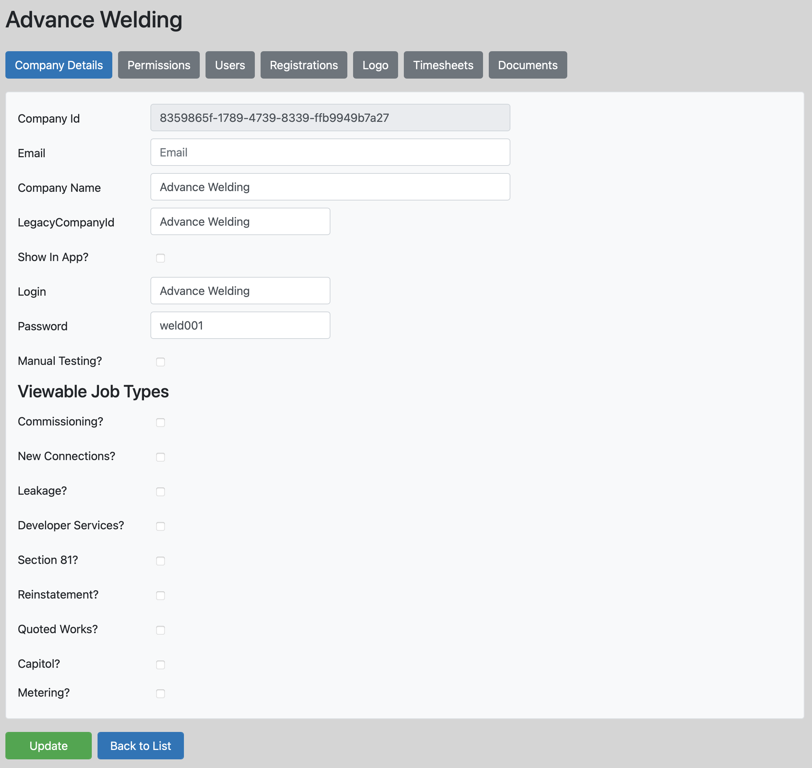

[Back to Index](readme.md)

# Company Details

The company details view is displayed when an existing company has been selected from the [Company List](#companies-list) or a new company has been created.

The company details are split over several tab screens.

## Company Details Tab

| Field | Notes |
| ----- | ----- |
| Company Id | The internal database identifier [(UUID)](https://en.wikipedia.org/wiki/Universally_unique_identifier) for the company. |
| LegacyCompanyId | The company id that was used in the older Piped Server application (if applicable) |
| Show in App | When selected this company will be listed in the Company selection of the Process Details view in the Pipelayer app (for Excel technicians only) |
| Manual Testing | An app setting which when enabled will default Pressure Loss and PE Pressure Tests to manual entry rather than using a Tibiis connection |

### Viewable Job Types

> Only applicable to companies who have 'MWS DCWW' as their parent company  

Determines which job types this child company of MWS DCWW can view when they use the [Process List](./process-list.md).

### Permissions Tab

Determines which tasks are displayed for this company's users in the Pipelayer App.

### Users Tab

> Refer to [Users List](./users-list.md) documentation

### Registrations Tab

A list of all app registrations (i.e. initial logins) for this company in Pipelayer App.

### Logo Tab

Use this tab to upload a logo for the company which will be used on exported PDFs and reports.

### Timesheets Tab

If this company is utilising the Timesheets feature of the Pipelayer App, entered timesheets will be summarised here.

Timesheets are listed in date descending order with one timesheet per user per week.

### Documents Tab

